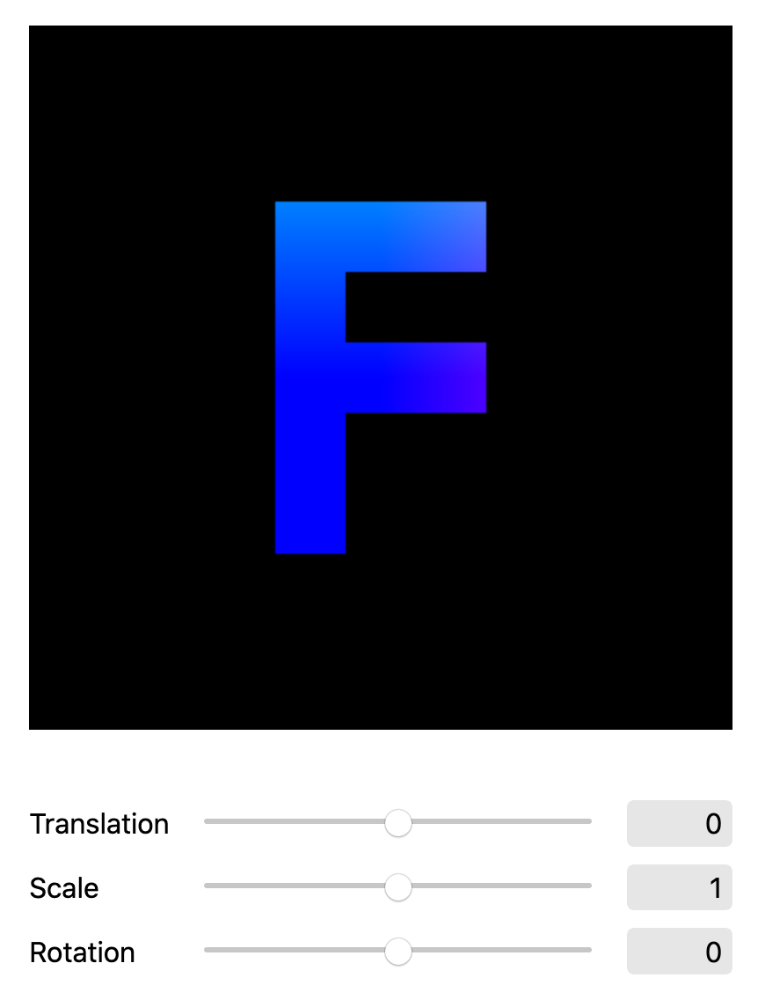

# Transformaciones

  

### Referencias 📚

- [WebGL 2 Fundamentals - 2D translation, rotation, scale, matrix math](https://webgl2fundamentals.org)
- [WebGL Programming Guide](https://www.oreilly.com/library/view/webgl-programming-guide/9780133364903/) `Capitulo 3 - Moving, Rotating, and Scaling`

### Uso 💻

Para correr el código, seguir las instrucciones de la sección **Usando los ejemplos** del repo [Recursos](https://github.com/computacion-grafica-uns/Recursos).
